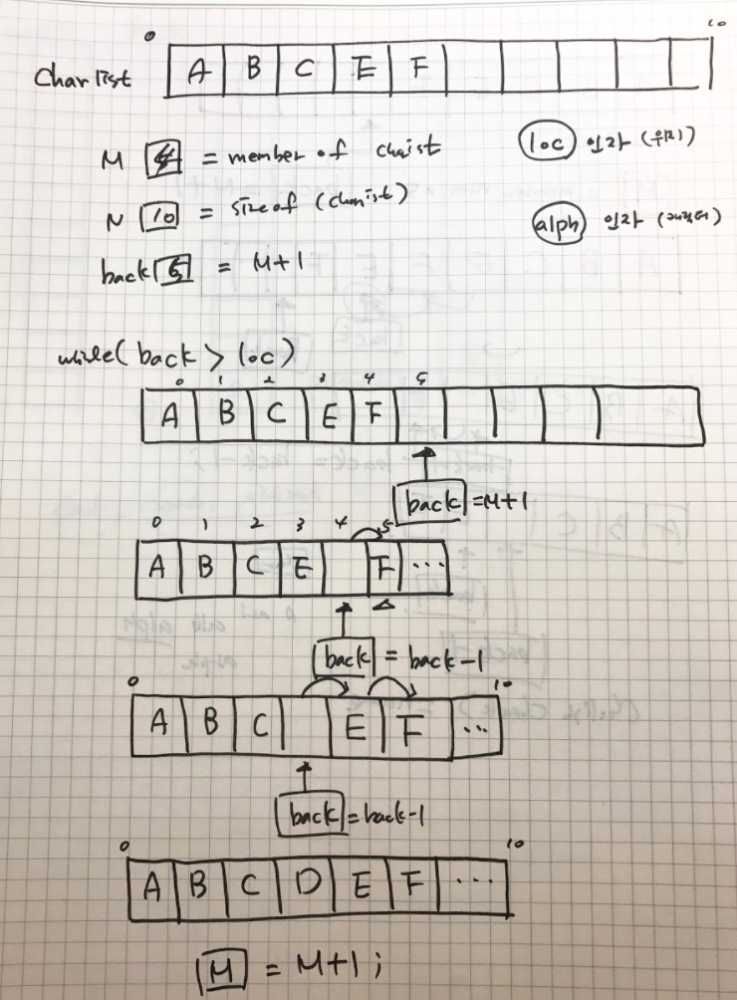

# 그림


## 요구사항
```{r, engine='bash', count_lines}
 >Here is the list for search : 0 1 2 3 4 5 6 7 8 9
found the number : 7

```
search함수를 이용하여 배열에서 7이라는 숫자를 출력하려고 합니다.
첫번째 그림처럼 num_List라는 배열을 주고 찾고자 하는 값을 7로 했을떄
인자로 준 배열을 출력하고, 찾은 값을 출력하도록 하면 됩니다 

## 구현방법
Search는 특정목록에서 특정값을 검색하는 작업을 하는 프로그램으로 검색될 요소의 위치를 알려주어야 합니다.이때 찾고자 하는 것을 명확히 정의 해주어야 합니다.
검색을 할때는 목록의 시작부터 목록의 끝까지 순차적으로 검색해 나가게 됩니다.

# 코드
[searching](./workbooksearch.c)

# 코드설명
search라는 함수는 인자로 찾을 값과 배열 그리고 그 배열의 크기를 갖게 됩니다.
변수 i의 역할은 for문의 인덱스 값의 역할을 하게되고, 
인자 값(찾을값)과 배열의 위치가 같아 질때까지 증가 하다가 값이 같아지면
변수 index에 i의 값을 할당시켜 주고 index 값을 반환한다 

------

# 그림


## 요구사항
```{r, engine='bash', count_lines}
>856941972
245678919
```

quickSort알고리즘을 이용하여 list배열을 순차적으로 정렬하고자합니다
그림 첫번째의 list배열을 주고 pivot값을 배열[0] 값으로 하였을때
결과값으로 순차적으로 정렬되어있는 배열이 출력 되게 하면 됩니다 

## 구현방법
qicksort알고리즘은 pivot를 기준으로 왼쪽에는 pivot보다 작은 수를, 오른쪽에는 pivot보다 큰수를 나열하게 되고 더 이상 배열이 나누어 질수 없을때까지 자기자신을 반복하게 됩니다.

# 코드
[quicksort](./quicksort.c)

# 코드설명
quicksort함수는 배열, 배열의 최대값, 최소값을 인자로 갖게 되고 pivot값을 할당하게 됩니다
그리고 partition함수를 이용해서 정렬을 하게 됩니다
partition함수는 인덱스i,j를 이용합니다 i는 배열의 맨앞쪽부터 1씩 증가해나가면서 pivot과 비교를 하다가 pivot 보다 큰수가 있으면 while문을 종료하게 되고 배열j번째는 배열의 맨끝부터 1씩감소해나가면서  pivot가 비교하게 됩니다 이때 배열j번째가 pivot 보다 작으면 배열i와 j의 값을 바꿔주게 됩니다
정열이끝나면 pivot을 두파트 사이에 자리 하게 되고, 각 파트들도 더이상 나누어 질수 없을때까지 반복정렬 해나가게 됩니다


------
# 그림


## 요구사항
```{r, engine='bash', count_lines}
From top to bottom 

2

From top to bottom

5

2

From top to bottom

7

5

2

After call pop : From top to bottom

5

2
```
push, pop연산을 이용하여 stack에 값을 추가하고 삭제하여 현재 스택의 값을 위와 같이 출력하면 됩니다 

# 구현방법
stack은 접시쌓기를 생각하시면 이해가 쉽습니다
접시가 쌓이고 제일 나중에 쌓인 접시부터 사용되게 되는 것처럼 
stack구조도 push연산을 통해 값이 추가 되고, pop연산을 통해 제일 위에 있는 값이 빠져나가게 됩니다. 이때 변수 top이 값이 들어올 자리와 값이 나갈자리를 가르키게 됩니다
2,5,7를 push연산을 이용해 stack에 추가하고, pop연산을 통해 7를 빼낼 것입니다
이때 stack의 상태를 확인하기 위해 연산할때마다 stack의 값들을 출력하면 됩니다

# 코드
[stack](./stack.c)

# 코드설명 
stack에 push연산을 이용하여 2,5,7를 추가하고, pop연산을 이용해 제일 위에 있는 값을 빼내고자 합니다

return type이 int 형인 push함수는 값을 추가하는 함수입니다. 인자로 정수를 갖습니다.
우선 stack이 가득 차있는 지 여부를 if문을 이용해서 확인하고 가득찼을 경우 메시지를 출력해줍니다. 가득차 있지 않다면 top을 1증가시킨후에 stack의 top자리에 인자로 들어온값을 할당해주고 그값을 반환합니다

return type이 int형인 pop함수는 stack의 값을 빼내는 함수로 인자로 정수를 갖습니다
stack이 비어있는 상태인지 if 문을 통해 확인하고 비어있지 않으면 현재 stack의 top번째 값을 인자에 할당해준뒤 top을 1감소시킵니다.

------

# 그림


## 요구사항
```{r, engine='bash', count_lines}
ABCEF
ABCEDF
```
insert함수를 이용해서 추가된 D를 포함한 배열을 출력하면 됩니다

# 구현방법 
기존 배열의 멤버들을 인자로 들어올 자리까지 옮겨준후에 그자리에 인자를 넣고 
배열을 출력하면 됩니다 

# 코드
[insertion](./insertion.c)

# 코드설명 

return type이 int인 insert함수는 인자로 alph(문자)와 배열에 들어올 위치 loc을 갖습니다

변수 back은 기존 배열을 옮긴후에 인자가 들어올 자리를 가르키며
변수 M는 배열의 크기를 나타내고
변수 N는 배열의 멤버들을 나타냅니다

배열에 인자가 들어오기 위해서는 배열안에 여부의 공간이 있어야 하기 때문에
M(배열의 크기)가 N(멤버)보다 커야 하기 때문에 if문을 이용해서 확인을 해주고
back을 멤버들보다 1큰 자리에 위치 시킵니다 

back이 인자로 들어올 위치 보다 작아질때까지 
back을 1씩 감소시켜 멤버들을 back 자리에 옮겨줍니다 

back이 loc보다 작아지면 그때 back자리에 alph(문자)를 넣어주고
멤버 수를 1증가시킵니다 

------

# 그림


## 요구사항

```{r, engine='bash', count_lines}
Series : 3  4  5  7  11  13  14  17  21
find 14 at series!
found at location : 6 
```

binarysearch를 이용하여 series 배열에서 14를 찾아 찾은 값의 위치를 출력하시오

# 구현방법
binarysearch는 배열의 계속해서 반으로 나누어 찾고자 하는 값과 비교해나가게 된다

배열의 중간에 위치한 값보다 찾고자 하는 값이 크면 배열의 중간+1의 위치 값부터 배열에 끝부분을 다시 반으로 나누어 같은 값을 찾을때까지 반복하게 된다
반대로 찾고자 하는 값이 배열의 중간위치의 값보다 작으면 배열의 0번째부터 중간-1까지의 부분을 다시 반으로 나누어 같은 값이 있을때까지 반복하게 된다

# 코드
[binsearch](./binsearch.c)

# 코드설명 

