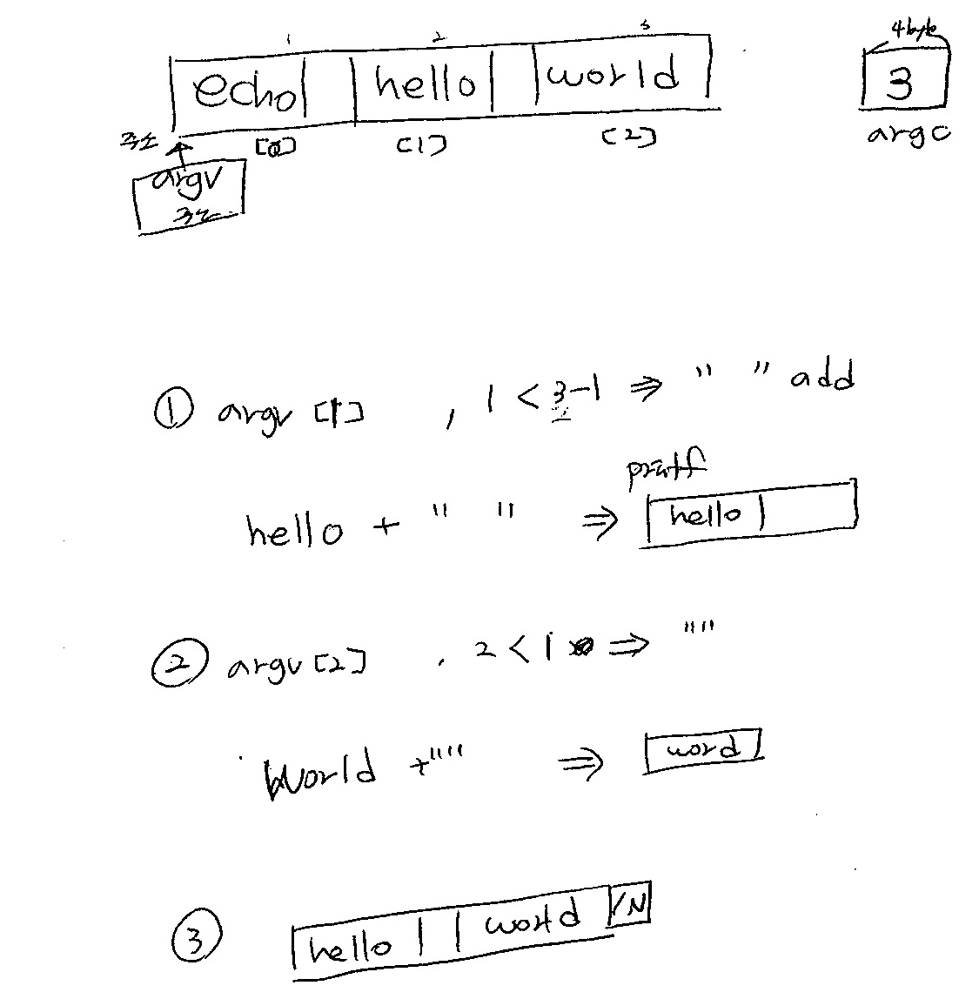

# 그림

# 코드
[coed](./echo_j.c)

# 코드설명

echo 함수는 인자값(문자 혹은 문자열)을 콘솔에 출력해주는 함수입니다

echo함수는 두개의 인자를 가지고있습니다
첫번째 인자는 인자의 개수를 나타내는  int argc이고,
두번째 인자는 인자들이 모인벡터의 문자배열타입의 포인터 변수 argv입니다

변수선언에서 int i는 포인터배열의 인덱스값으로 사용됩니다

함수구현단에 for문을 보면 i가 1부터 시작하는 이유는 echo함수가 인자로 
자기 자신을(echo)  포함하고있기 때문에 적어도 1개이상의 함수가 있어야 하기 때문입니다 예를 들어 echo 함수를 사용할때는 echo hello world 처럼 echo를 포함하여 사용해주어야 합니다

인자의 개수가 i보다 클때까지만 즉 인자의 개수만큼 실행하고 i를 1씩증가시킵니다
printf를 실행할때는 포인터배열의 i번째를 출력하게 되고 i번째 뒤에 인자가 있다면 공백" "를 추가하여 출력하게 됩니다

# 예제

